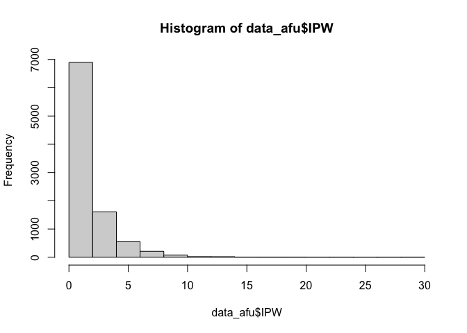

```r
library(tidyverse)
library(survey)
library(plyr)
library(dplyr)
library(factoextra)
library(labelled)
library(tableone)
library(memisc)
library(jtools)
library(Publish)
library(flextable)
```

# Motivation
Many individuals did not respond to the genetic testing survey. Are these individuals different than those who responded? in what way? we create a simple table that compares the characteristics of respondents to non-respondents. To compute weights, we use probabilities of participation in the AFU. 

# Setting up working directory

```r
base_path <- "~/Dropbox (Partners HealthCare)/SOL_misc_genetics/survey_gen_test_utilization/20210917_data_code/"

data_file_w_afu_probs <- paste0(base_path, "Processed_data/20210918_organized_visit1_covariates_with_prob_AFU.RData")
data_file_w_visit2_covars <- paste0(base_path, "Processed_data/20210918_organized_covariates_updated_from_vis2.RData")
surve_gen_file <- paste0(base_path, "/Preprocessed_data/solfu_gte_20200730.csv")
output_dir <- paste0(base_path, "Results")
```

# Loading the data and compute weights
The weights here are based on participation in the AFU, not in the genetic testing survey.

```r
# load the data set with the compute probabilites of participation in the AFU
data_afu <- readRDS(data_file_w_afu_probs)
nrow(data_afu)
```

```
## [1] 16415
```

```r
# compute IPW for this analysis
data_afu$IPW <- data_afu$WEIGHT_FINAL_NORM_OVERALL*
                          (1/data_afu$prob_AFU)
data_afu <- data_afu[which(data_afu$AFU_par == 1),]  
hist(data_afu$IPW)
```

<!-- -->

```r
# load the dataset with covariates with information from visit 2 when possible (rather than from visit 1)
data_2 <- readRDS(data_file_w_visit2_covars)

# create GTE participation variable
# read the genetic testing survey data: 
survey_gen <- read.csv(surve_gen_file)

# remove rows with data from afu_year =2 
survey_gen <- survey_gen[-which(survey_gen$AFU_YEAR==2),]

# create a variable that indicates whether a participate responded to the genetic testing survey according to the response to the awareness questions
survey_gen$aware <- NA
survey_gen$aware[which(survey_gen$GTE1 == 1 | 
                         survey_gen$GTE2 == 1 | 
                         survey_gen$GTE3 == 1 | 
                         survey_gen$GTE4 == 1)] <- 1
survey_gen$aware[which(is.na(survey_gen$aware) & 
                         (survey_gen$GTE1 == 0 | 
                         survey_gen$GTE2 == 0 | 
                         survey_gen$GTE3 == 0 | 
                         survey_gen$GTE4 == 0))] <- 0

survey_gen$gte_par <- NA
survey_gen$gte_par[which(survey_gen$aware == 0 | survey_gen$aware == 1)] <- 1 

gte_par_id <- unique(survey_gen$ID[which(survey_gen$gte_par == 1)])

data_2$GTE_par <- "no"
data_2$GTE_par[match(gte_par_id, data_2$ID)] <- "yes"

# Add the computed IPW to the data
data <- merge(data_2, data_afu[,c("ID", "IPW")], by = "ID")


survey_afu <- svydesign(id=~PSU_ID, strata=~STRAT, weights=~IPW , data=data)
# trim weights at 15
survey_trim <- trimWeights(survey_afu,upper = 15)
```


# Generate a table stratified by participation in the genetic testing survey


```r
tbl_var <-c("AGE","SEX", "CENTER","Education","Income_level","Current_Health_insurance","Physician_Visit", "Background", "Language_pref", "Marital_status","Employment_status", "US_BORN")

tbl1_noweight_gte <- print(CreateTableOne(vars = tbl_var,strata = "GTE_par",data = data),missing=TRUE,varLabels = TRUE,digits =3,pDigits=3,showAllLevels=TRUE)
```

```
##                               Stratified by GTE_par
##                                level                              
##   n                                                               
##   AGE (mean (SD))                                                 
##   SEX (%)                      Female                             
##                                Male                               
##   CENTER (%)                   Bronx                              
##                                Chicago                            
##                                Miami                              
##                                San Diego                          
##   Education (%)                <12                                
##                                12                                 
##                                >12                                
##   Income_level (%)             Less than $10,000                  
##                                $10,001-$20,000                    
##                                $20,001-$40,000                    
##                                $40,001-$75,000                    
##                                More than $75,000                  
##   Current_Health_insurance (%) No                                 
##                                Yes                                
##   Physician_Visit (%)          No                                 
##                                One or two times                   
##                                At least three times               
##   Background (%)               Domician                           
##                                Central American                   
##                                Cuban                              
##                                Mexican                            
##                                Puerto Rican                       
##                                South American                     
##                                More than one/Other heritage       
##   Language_pref (%)            Spanish                            
##                                English                            
##   Marital_status (%)           Single                             
##                                Married or living with a partner   
##                                Separated,divorced,or widow(er)    
##   Employment_status (%)        Retired/not currently employed     
##                                Employed part-time(<=35 hours/week)
##                                Employed full-time(>35 hours/week) 
##   US_BORN (%)                  No                                 
##                                Yes                                
##                               Stratified by GTE_par
##                                no            yes           p     
##   n                             3639          5769               
##   AGE (mean (SD))              46.31 (13.80) 45.81 (13.23)  0.081
##   SEX (%)                       2249 (61.8)   3701 (64.2)   0.023
##                                 1390 (38.2)   2068 (35.8)        
##   CENTER (%)                    1357 (37.3)   1030 (17.9)  <0.001
##                                  658 (18.1)   1950 (33.8)        
##                                  736 (20.2)   1065 (18.5)        
##                                  888 (24.4)   1724 (29.9)        
##   Education (%)                 1415 (39.2)   1928 (33.5)  <0.001
##                                  915 (25.4)   1353 (23.5)        
##                                 1279 (35.4)   2467 (42.9)        
##   Income_level (%)               486 (13.9)    613 (10.9)  <0.001
##                                 1057 (30.3)   1532 (27.2)        
##                                 1162 (33.3)   1999 (35.5)        
##                                  571 (16.4)   1039 (18.5)        
##                                  214 ( 6.1)    441 ( 7.8)        
##   Current_Health_insurance (%)  1037 (28.9)   1686 (29.3)   0.690
##                                 2552 (71.1)   4068 (70.7)        
##   Physician_Visit (%)            944 (26.7)   1521 (26.7)   0.824
##                                 1113 (31.4)   1820 (32.0)        
##                                 1484 (41.9)   2352 (41.3)        
##   Background (%)                 449 (12.4)    413 ( 7.2)  <0.001
##                                  332 ( 9.2)    575 (10.0)        
##                                  426 (11.8)    593 (10.3)        
##                                 1344 (37.3)   2753 (47.9)        
##                                  717 (19.9)    820 (14.3)        
##                                  228 ( 6.3)    424 ( 7.4)        
##                                  112 ( 3.1)    172 ( 3.0)        
##   Language_pref (%)             2859 (78.6)   4731 (82.0)  <0.001
##                                  780 (21.4)   1038 (18.0)        
##   Marital_status (%)             906 (25.0)   1234 (21.4)  <0.001
##                                 1935 (53.5)   3288 (57.1)        
##                                  777 (21.5)   1240 (21.5)        
##   Employment_status (%)         1660 (46.3)   2362 (41.1)  <0.001
##                                  730 (20.3)   1318 (22.9)        
##                                 1199 (33.4)   2071 (36.0)        
##   US_BORN (%)                   2969 (82.2)   4835 (84.0)   0.021
##                                  643 (17.8)    918 (16.0)        
##                               Stratified by GTE_par
##                                test Missing
##   n                                        
##   AGE (mean (SD))                   0.0    
##   SEX (%)                           0.0    
##                                            
##   CENTER (%)                        0.0    
##                                            
##                                            
##                                            
##   Education (%)                     0.5    
##                                            
##                                            
##   Income_level (%)                  3.1    
##                                            
##                                            
##                                            
##                                            
##   Current_Health_insurance (%)      0.7    
##                                            
##   Physician_Visit (%)               1.8    
##                                            
##                                            
##   Background (%)                    0.5    
##                                            
##                                            
##                                            
##                                            
##                                            
##                                            
##   Language_pref (%)                 0.0    
##                                            
##   Marital_status (%)                0.3    
##                                            
##                                            
##   Employment_status (%)             0.7    
##                                            
##                                            
##   US_BORN (%)                       0.5    
## 
```

```r
tbl1_weighted_gte <- print(svyCreateTableOne(vars = tbl_var, strata = "GTE_par", data = survey_trim), missing=TRUE, varLabels = TRUE,digits =3,pDigits=3,showAllLevels=TRUE)
```

```
##                               Stratified by GTE_par
##                                level                              
##   n                                                               
##   AGE (mean (SD))                                                 
##   SEX (%)                      Female                             
##                                Male                               
##   CENTER (%)                   Bronx                              
##                                Chicago                            
##                                Miami                              
##                                San Diego                          
##   Education (%)                <12                                
##                                12                                 
##                                >12                                
##   Income_level (%)             Less than $10,000                  
##                                $10,001-$20,000                    
##                                $20,001-$40,000                    
##                                $40,001-$75,000                    
##                                More than $75,000                  
##   Current_Health_insurance (%) No                                 
##                                Yes                                
##   Physician_Visit (%)          No                                 
##                                One or two times                   
##                                At least three times               
##   Background (%)               Domician                           
##                                Central American                   
##                                Cuban                              
##                                Mexican                            
##                                Puerto Rican                       
##                                South American                     
##                                More than one/Other heritage       
##   Language_pref (%)            Spanish                            
##                                English                            
##   Marital_status (%)           Single                             
##                                Married or living with a partner   
##                                Separated,divorced,or widow(er)    
##   Employment_status (%)        Retired/not currently employed     
##                                Employed part-time(<=35 hours/week)
##                                Employed full-time(>35 hours/week) 
##   US_BORN (%)                  No                                 
##                                Yes                                
##                               Stratified by GTE_par
##                                no              yes            
##   n                            6529.30         9547.54        
##   AGE (mean (SD))                41.29 (15.25)   40.70 (14.55)
##   SEX (%)                       3338.5 (51.1)   5089.4 (53.3) 
##                                 3190.8 (48.9)   4458.2 (46.7) 
##   CENTER (%)                    2738.4 (41.9)   2068.6 (21.7) 
##                                  584.8 ( 9.0)   1946.0 (20.4) 
##                                 1983.7 (30.4)   2633.1 (27.6) 
##                                 1222.5 (18.7)   2899.9 (30.4) 
##   Education (%)                 2286.0 (35.2)   2570.8 (27.0) 
##                                 1729.3 (26.6)   2315.1 (24.3) 
##                                 2476.3 (38.1)   4637.1 (48.7) 
##   Income_level (%)               897.7 (14.5)    903.7 ( 9.7) 
##                                 1776.8 (28.7)   2387.0 (25.7) 
##                                 2031.1 (32.8)   3195.2 (34.4) 
##                                 1067.4 (17.2)   1826.3 (19.7) 
##                                  417.4 ( 6.7)    978.5 (10.5) 
##   Current_Health_insurance (%)  1993.8 (30.9)   2994.4 (31.5) 
##                                 4449.4 (69.1)   6519.3 (68.5) 
##   Physician_Visit (%)           1973.7 (31.1)   3008.6 (32.0) 
##                                 1964.3 (30.9)   2833.4 (30.2) 
##                                 2416.8 (38.0)   3555.4 (37.8) 
##   Background (%)                 877.0 (13.6)    771.0 ( 8.1) 
##                                  495.6 ( 7.7)    661.8 ( 7.0) 
##                                 1369.2 (21.2)   1824.9 (19.2) 
##                                 1900.5 (29.4)   4040.8 (42.4) 
##                                 1238.8 (19.1)   1372.1 (14.4) 
##                                  302.5 ( 4.7)    494.0 ( 5.2) 
##                                  286.4 ( 4.4)    355.1 ( 3.7) 
##   Language_pref (%)             4777.6 (73.2)   7229.6 (75.7) 
##                                 1751.7 (26.8)   2317.9 (24.3) 
##   Marital_status (%)            2155.9 (33.1)   2767.5 (29.0) 
##                                 3127.6 (48.1)   5098.7 (53.5) 
##                                 1221.7 (18.8)   1671.0 (17.5) 
##   Employment_status (%)         2870.9 (44.5)   3554.1 (37.4) 
##                                 1298.6 (20.1)   2111.4 (22.2) 
##                                 2279.7 (35.3)   3844.4 (40.4) 
##   US_BORN (%)                   5002.9 (77.0)   7381.3 (77.5) 
##                                 1491.0 (23.0)   2141.1 (22.5) 
##                               Stratified by GTE_par
##                                p      test Missing
##   n                                               
##   AGE (mean (SD))               0.222      0.0    
##   SEX (%)                       0.160      0.0    
##                                                   
##   CENTER (%)                   <0.001      0.0    
##                                                   
##                                                   
##                                                   
##   Education (%)                <0.001      0.5    
##                                                   
##                                                   
##   Income_level (%)             <0.001      3.1    
##                                                   
##                                                   
##                                                   
##                                                   
##   Current_Health_insurance (%)  0.704      0.7    
##                                                   
##   Physician_Visit (%)           0.774      1.8    
##                                                   
##                                                   
##   Background (%)               <0.001      0.5    
##                                                   
##                                                   
##                                                   
##                                                   
##                                                   
##                                                   
##   Language_pref (%)             0.080      0.0    
##                                                   
##   Marital_status (%)            0.003      0.3    
##                                                   
##                                                   
##   Employment_status (%)        <0.001      0.7    
##                                                   
##                                                   
##   US_BORN (%)                   0.748      0.5    
## 
```

Merge weighted and unweighted tables

```r
tbl1_comb <- tbl1_noweight_gte
col_inds_to_update <- which(colnames(tbl1_noweight_gte) %in% c("no", "yes"))

# update tbl1_comb with the percentages from the weighted table
for (i in col_inds_to_update){
  counts <- sapply(tbl1_noweight_gte[,i], function(x){
                  strsplit(x, split = "(", fixed = TRUE)[[1]][1]
                 })
  percnt <- sapply(tbl1_weighted_gte[,i], function(x){
                paste0("(",  strsplit(x, split = "(", fixed = TRUE)[[1]][2])
              })
  tbl1_comb[,i] <- paste0(counts, percnt)
}

tbl1_comb_flex <- flextable(as.data.frame(tbl1_comb))
  
write.csv(tbl1_comb,paste0(output_dir,"/20210930_characteristics_gte_par_no_par.csv"))
flextable::save_as_docx(tbl1_comb_flex, path = paste0(output_dir, "/20210930_characteristics_gte_par_no_par.docx"))
```


# version:

```r
sessionInfo()
```

```
## R version 4.0.3 (2020-10-10)
## Platform: x86_64-apple-darwin17.0 (64-bit)
## Running under: macOS Catalina 10.15.7
## 
## Matrix products: default
## BLAS:   /System/Library/Frameworks/Accelerate.framework/Versions/A/Frameworks/vecLib.framework/Versions/A/libBLAS.dylib
## LAPACK: /Library/Frameworks/R.framework/Versions/4.0/Resources/lib/libRlapack.dylib
## 
## locale:
## [1] en_US.UTF-8/en_US.UTF-8/en_US.UTF-8/C/en_US.UTF-8/en_US.UTF-8
## 
## attached base packages:
## [1] grid      stats     graphics  grDevices utils     datasets 
## [7] methods   base     
## 
## other attached packages:
##  [1] flextable_0.6.6    Publish_2020.12.23 prodlim_2019.11.13
##  [4] jtools_2.1.3       memisc_0.99.27.3   MASS_7.3-53.1     
##  [7] lattice_0.20-41    tableone_0.12.0    labelled_2.8.0    
## [10] factoextra_1.0.7   plyr_1.8.6         survey_4.0        
## [13] survival_3.2-9     Matrix_1.3-2       forcats_0.5.1     
## [16] stringr_1.4.0      dplyr_1.0.5        purrr_0.3.4       
## [19] readr_1.4.0        tidyr_1.1.3        tibble_3.1.0      
## [22] ggplot2_3.3.3      tidyverse_1.3.0    rmarkdown_2.7     
## 
## loaded via a namespace (and not attached):
##  [1] fs_1.5.0          lubridate_1.7.10  httr_1.4.2       
##  [4] repr_1.1.3        tools_4.0.3       backports_1.2.1  
##  [7] bslib_0.2.4       utf8_1.2.1        R6_2.5.0         
## [10] DBI_1.1.1         colorspace_2.0-0  withr_2.4.1      
## [13] tidyselect_1.1.0  curl_4.3          compiler_4.0.3   
## [16] cli_3.0.1         rvest_1.0.0       xml2_1.3.2       
## [19] officer_0.3.18    sass_0.3.1        scales_1.1.1     
## [22] proxy_0.4-25      systemfonts_1.0.1 digest_0.6.27    
## [25] foreign_0.8-81    rio_0.5.26        base64enc_0.1-3  
## [28] pkgconfig_2.0.3   htmltools_0.5.1.1 highr_0.8        
## [31] dbplyr_2.1.0      rlang_0.4.10      readxl_1.3.1     
## [34] rstudioapi_0.13   jquerylib_0.1.3   generics_0.1.0   
## [37] zoo_1.8-9         jsonlite_1.7.2    zip_2.1.1        
## [40] car_3.0-10        magrittr_2.0.1    Rcpp_1.0.6       
## [43] munsell_0.5.0     fansi_0.4.2       abind_1.4-5      
## [46] gdtools_0.2.3     lifecycle_1.0.0   stringi_1.5.3    
## [49] yaml_2.2.1        carData_3.0-4     ggrepel_0.9.1    
## [52] crayon_1.4.1      haven_2.3.1       splines_4.0.3    
## [55] pander_0.6.3      hms_1.0.0         knitr_1.31       
## [58] pillar_1.5.1      uuid_0.1-4        reprex_1.0.0     
## [61] glue_1.4.2        evaluate_0.14     mitools_2.4      
## [64] data.table_1.14.0 modelr_0.1.8      vctrs_0.3.6      
## [67] cellranger_1.1.0  gtable_0.3.0      assertthat_0.2.1 
## [70] xfun_0.22         openxlsx_4.2.3    broom_0.7.8      
## [73] e1071_1.7-5       class_7.3-18      lava_1.6.9       
## [76] ellipsis_0.3.1
```
