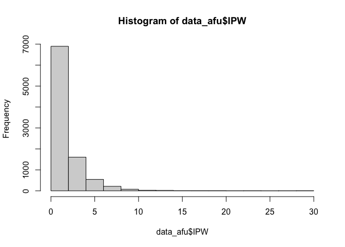

```r
library(tidyverse)
library(survey)
library(plyr)
library(dplyr)
library(factoextra)
library(labelled)
library(tableone)
library(memisc)
library(jtools)
library(Publish)
library(flextable)
```

# Motivation
Many individuals did not respond to the genetic testing survey. Are these individuals different than those who responded? in what way? we create a simple table that compares the characteristics of respondents to non-respondents. To compute weights, we use probabilities of participation in the AFU. 

# Setting up working directory

```r
base_path <- "~/Dropbox (Partners HealthCare)/SOL_misc_genetics/survey_gen_test_utilization/20221003_data_code/"

data_file_w_afu_probs <- paste0(base_path, "Processed_data/organized_visit1_covariates_with_prob_AFU.RData")
data_file_w_visit2_covars <- paste0(base_path, "Processed_data/organized_covariates_updated_from_vis2.RData")
surve_gen_file <- paste0(base_path, "/Preprocessed_data/solfu_gte_20211122.csv")
output_dir <- paste0(base_path, "Results")
```

# Loading the data and compute weights
The weights here are based on participation in the AFU, not in the genetic testing survey.

```r
# load the data set with the compute probabilites of participation in the AFU
data_afu <- readRDS(data_file_w_afu_probs)
nrow(data_afu)
```

```
## [1] 16415
```

```r
# compute IPW for this analysis
data_afu$IPW <- data_afu$WEIGHT_FINAL_NORM_OVERALL*
                          (1/data_afu$prob_AFU)
data_afu <- data_afu[which(data_afu$AFU_par == 1),]  
hist(data_afu$IPW)
```

<!-- -->

```r
# load the dataset with covariates with information from visit 2 when possible (rather than from visit 1)
data_2 <- readRDS(data_file_w_visit2_covars)

# create GTE participation variable
# read the genetic testing survey data: 
survey_gen <- read.csv(surve_gen_file)

# remove rows with data from afu_year =2 
survey_gen <- survey_gen[-which(survey_gen$AFU_YEAR==2),]

# create a variable that indicates whether a participate responded to the genetic testing survey according to the response to the awareness questions
survey_gen$aware <- NA
survey_gen$aware[which(survey_gen$GTE1 == 1 | 
                         survey_gen$GTE2 == 1 | 
                         survey_gen$GTE3 == 1 | 
                         survey_gen$GTE4 == 1)] <- 1
survey_gen$aware[which(is.na(survey_gen$aware) & 
                         (survey_gen$GTE1 == 0 | 
                         survey_gen$GTE2 == 0 | 
                         survey_gen$GTE3 == 0 | 
                         survey_gen$GTE4 == 0))] <- 0

survey_gen$gte_par <- NA
survey_gen$gte_par[which(survey_gen$aware == 0 | survey_gen$aware == 1)] <- 1 

gte_par_id <- unique(survey_gen$ID[which(survey_gen$gte_par == 1)])

data_2$GTE_par <- "no"
data_2$GTE_par[match(gte_par_id, data_2$ID)] <- "yes"

# Add the computed IPW to the data
data <- merge(data_2, data_afu[,c("ID", "IPW")], by = "ID")


survey_afu <- svydesign(id=~PSU_ID, strata=~STRAT, weights=~IPW , data=data)
# trim weights at 15
survey_trim <- trimWeights(survey_afu,upper = 15)
```


# Generate a table stratified by participation in the genetic testing survey


```r
tbl_var <-c("AGE","SEX", "CENTER","Education","Income_level","Current_Health_insurance","Physician_Visit", "Background", "Language_pref", "Marital_status","Employment_status", "US_BORN")

tbl1_noweight_gte <- print(CreateTableOne(vars = tbl_var,strata = "GTE_par",data = data),missing=TRUE,varLabels = TRUE,digits =3,pDigits=3,showAllLevels=TRUE)
```

```
##                               Stratified by GTE_par
##                                level                              
##   n                                                               
##   AGE (mean (SD))                                                 
##   SEX (%)                      Female                             
##                                Male                               
##   CENTER (%)                   Bronx                              
##                                Chicago                            
##                                Miami                              
##                                San Diego                          
##   Education (%)                <12                                
##                                12                                 
##                                >12                                
##                                Masters, doctoral, professional    
##   Income_level (%)             Less than $10,000                  
##                                $10,001-$20,000                    
##                                $20,001-$40,000                    
##                                $40,001-$75,000                    
##                                More than $75,000                  
##   Current_Health_insurance (%) No                                 
##                                Yes                                
##   Physician_Visit (%)          No                                 
##                                One or two times                   
##                                At least three times               
##   Background (%)               Domician                           
##                                Central American                   
##                                Cuban                              
##                                Mexican                            
##                                Puerto Rican                       
##                                South American                     
##                                More than one/Other heritage       
##   Language_pref (%)            Spanish                            
##                                English                            
##   Marital_status (%)           Single                             
##                                Married or living with a partner   
##                                Separated,divorced,or widow(er)    
##   Employment_status (%)        Retired/not currently employed     
##                                Employed part-time(<=35 hours/week)
##                                Employed full-time(>35 hours/week) 
##   US_BORN (%)                  No                                 
##                                Yes                                
##                               Stratified by GTE_par
##                                no            yes           p      test
##   n                             3639          5769                    
##   AGE (mean (SD))              46.31 (13.80) 45.81 (13.23)  0.081     
##   SEX (%)                       2249 (61.8)   3701 (64.2)   0.023     
##                                 1390 (38.2)   2068 (35.8)             
##   CENTER (%)                    1357 (37.3)   1030 (17.9)  <0.001     
##                                  658 (18.1)   1950 (33.8)             
##                                  736 (20.2)   1065 (18.5)             
##                                  888 (24.4)   1724 (29.9)             
##   Education (%)                 1464 (40.6)   2004 (34.9)  <0.001     
##                                  946 (26.2)   1458 (25.4)             
##                                 1103 (30.6)   2078 (36.2)             
##                                   95 ( 2.6)    206 ( 3.6)             
##   Income_level (%)               486 (13.9)    613 (10.9)  <0.001     
##                                 1057 (30.3)   1532 (27.2)             
##                                 1162 (33.3)   1999 (35.5)             
##                                  571 (16.4)   1039 (18.5)             
##                                  214 ( 6.1)    441 ( 7.8)             
##   Current_Health_insurance (%)  1037 (28.9)   1686 (29.3)   0.690     
##                                 2552 (71.1)   4068 (70.7)             
##   Physician_Visit (%)            944 (26.7)   1521 (26.7)   0.824     
##                                 1113 (31.4)   1820 (32.0)             
##                                 1484 (41.9)   2352 (41.3)             
##   Background (%)                 449 (12.4)    413 ( 7.2)  <0.001     
##                                  332 ( 9.2)    575 (10.0)             
##                                  426 (11.8)    593 (10.3)             
##                                 1344 (37.3)   2753 (47.9)             
##                                  717 (19.9)    820 (14.3)             
##                                  228 ( 6.3)    424 ( 7.4)             
##                                  112 ( 3.1)    172 ( 3.0)             
##   Language_pref (%)             2859 (78.6)   4731 (82.0)  <0.001     
##                                  780 (21.4)   1038 (18.0)             
##   Marital_status (%)             906 (25.0)   1234 (21.4)  <0.001     
##                                 1935 (53.5)   3288 (57.1)             
##                                  777 (21.5)   1240 (21.5)             
##   Employment_status (%)         1660 (46.3)   2362 (41.1)  <0.001     
##                                  730 (20.3)   1318 (22.9)             
##                                 1199 (33.4)   2071 (36.0)             
##   US_BORN (%)                   2969 (82.2)   4835 (84.0)   0.021     
##                                  643 (17.8)    918 (16.0)             
##                               Stratified by GTE_par
##                                Missing
##   n                                   
##   AGE (mean (SD))              0.0    
##   SEX (%)                      0.0    
##                                       
##   CENTER (%)                   0.0    
##                                       
##                                       
##                                       
##   Education (%)                0.6    
##                                       
##                                       
##                                       
##   Income_level (%)             3.1    
##                                       
##                                       
##                                       
##                                       
##   Current_Health_insurance (%) 0.7    
##                                       
##   Physician_Visit (%)          1.8    
##                                       
##                                       
##   Background (%)               0.5    
##                                       
##                                       
##                                       
##                                       
##                                       
##                                       
##   Language_pref (%)            0.0    
##                                       
##   Marital_status (%)           0.3    
##                                       
##                                       
##   Employment_status (%)        0.7    
##                                       
##                                       
##   US_BORN (%)                  0.5    
## 
```

```r
tbl1_weighted_gte <- print(svyCreateTableOne(vars = tbl_var, strata = "GTE_par", data = survey_trim), missing=TRUE, varLabels = TRUE,digits =3,pDigits=3,showAllLevels=TRUE)
```

```
##                               Stratified by GTE_par
##                                level                              
##   n                                                               
##   AGE (mean (SD))                                                 
##   SEX (%)                      Female                             
##                                Male                               
##   CENTER (%)                   Bronx                              
##                                Chicago                            
##                                Miami                              
##                                San Diego                          
##   Education (%)                <12                                
##                                12                                 
##                                >12                                
##                                Masters, doctoral, professional    
##   Income_level (%)             Less than $10,000                  
##                                $10,001-$20,000                    
##                                $20,001-$40,000                    
##                                $40,001-$75,000                    
##                                More than $75,000                  
##   Current_Health_insurance (%) No                                 
##                                Yes                                
##   Physician_Visit (%)          No                                 
##                                One or two times                   
##                                At least three times               
##   Background (%)               Domician                           
##                                Central American                   
##                                Cuban                              
##                                Mexican                            
##                                Puerto Rican                       
##                                South American                     
##                                More than one/Other heritage       
##   Language_pref (%)            Spanish                            
##                                English                            
##   Marital_status (%)           Single                             
##                                Married or living with a partner   
##                                Separated,divorced,or widow(er)    
##   Employment_status (%)        Retired/not currently employed     
##                                Employed part-time(<=35 hours/week)
##                                Employed full-time(>35 hours/week) 
##   US_BORN (%)                  No                                 
##                                Yes                                
##                               Stratified by GTE_par
##                                no              yes             p      test
##   n                            6529.12         9551.47                    
##   AGE (mean (SD))                41.30 (15.24)   40.69 (14.55)  0.211     
##   SEX (%)                       3337.3 (51.1)   5091.7 (53.3)   0.156     
##                                 3191.8 (48.9)   4459.8 (46.7)             
##   CENTER (%)                    2738.4 (41.9)   2070.2 (21.7)  <0.001     
##                                  584.8 ( 9.0)   1946.4 (20.4)             
##                                 1983.4 (30.4)   2633.7 (27.6)             
##                                 1222.6 (18.7)   2901.2 (30.4)             
##   Education (%)                 2398.6 (36.9)   2739.2 (28.8)  <0.001     
##                                 1818.3 (28.0)   2560.2 (26.9)             
##                                 2137.0 (32.9)   3846.2 (40.4)             
##                                  138.5 ( 2.1)    376.5 ( 4.0)             
##   Income_level (%)               896.7 (14.5)    903.4 ( 9.7)  <0.001     
##                                 1777.1 (28.7)   2388.3 (25.7)             
##                                 2030.6 (32.8)   3195.2 (34.4)             
##                                 1070.1 (17.3)   1829.9 (19.7)             
##                                  417.2 ( 6.7)    978.2 (10.5)             
##   Current_Health_insurance (%)  1994.5 (31.0)   2996.8 (31.5)   0.703     
##                                 4448.6 (69.0)   6520.5 (68.5)             
##   Physician_Visit (%)           1976.6 (31.1)   3012.6 (32.0)   0.776     
##                                 1962.5 (30.9)   2830.5 (30.1)             
##                                 2416.2 (38.0)   3558.2 (37.8)             
##   Background (%)                 878.6 (13.6)    772.4 ( 8.1)  <0.001     
##                                  495.5 ( 7.7)    662.3 ( 7.0)             
##                                 1369.7 (21.2)   1825.1 (19.2)             
##                                 1900.9 (29.4)   4042.9 (42.4)             
##                                 1239.3 (19.2)   1373.9 (14.4)             
##                                  302.5 ( 4.7)    493.6 ( 5.2)             
##                                  285.0 ( 4.4)    353.6 ( 3.7)             
##   Language_pref (%)             4777.3 (73.2)   7231.1 (75.7)   0.082     
##                                 1751.8 (26.8)   2320.4 (24.3)             
##   Marital_status (%)            2155.9 (33.1)   2772.3 (29.1)   0.003     
##                                 3127.9 (48.1)   5098.1 (53.4)             
##                                 1222.2 (18.8)   1671.1 (17.5)             
##   Employment_status (%)         2869.8 (44.5)   3554.8 (37.4)  <0.001     
##                                 1299.5 (20.1)   2113.4 (22.2)             
##                                 2280.1 (35.4)   3845.6 (40.4)             
##   US_BORN (%)                   5003.1 (77.0)   7381.9 (77.5)   0.758     
##                                 1491.9 (23.0)   2144.8 (22.5)             
##                               Stratified by GTE_par
##                                Missing
##   n                                   
##   AGE (mean (SD))              0.0    
##   SEX (%)                      0.0    
##                                       
##   CENTER (%)                   0.0    
##                                       
##                                       
##                                       
##   Education (%)                0.6    
##                                       
##                                       
##                                       
##   Income_level (%)             3.1    
##                                       
##                                       
##                                       
##                                       
##   Current_Health_insurance (%) 0.7    
##                                       
##   Physician_Visit (%)          1.8    
##                                       
##                                       
##   Background (%)               0.5    
##                                       
##                                       
##                                       
##                                       
##                                       
##                                       
##   Language_pref (%)            0.0    
##                                       
##   Marital_status (%)           0.3    
##                                       
##                                       
##   Employment_status (%)        0.7    
##                                       
##                                       
##   US_BORN (%)                  0.5    
## 
```

Merge weighted and unweighted tables

```r
tbl1_comb <- tbl1_noweight_gte
col_inds_to_update <- which(colnames(tbl1_noweight_gte) %in% c("no", "yes"))

# update tbl1_comb with the percentages from the weighted table
for (i in col_inds_to_update){
  counts <- sapply(tbl1_noweight_gte[,i], function(x){
                  strsplit(x, split = "(", fixed = TRUE)[[1]][1]
                 })
  percnt <- sapply(tbl1_weighted_gte[,i], function(x){
                paste0("(",  strsplit(x, split = "(", fixed = TRUE)[[1]][2])
              })
  tbl1_comb[,i] <- paste0(counts, percnt)
}

tbl1_comb_flex <- flextable(as.data.frame(tbl1_comb))
  
write.csv(tbl1_comb,paste0(output_dir,"/characteristics_gte_par_no_par.csv"))
flextable::save_as_docx(tbl1_comb_flex, path = paste0(output_dir, "/characteristics_gte_par_no_par.docx"))
```


# version:

```r
sessionInfo()
```

```
## R version 4.0.3 (2020-10-10)
## Platform: x86_64-apple-darwin17.0 (64-bit)
## Running under: macOS  12.5.1
## 
## Matrix products: default
## LAPACK: /Library/Frameworks/R.framework/Versions/4.0/Resources/lib/libRlapack.dylib
## 
## locale:
## [1] en_US.UTF-8/en_US.UTF-8/en_US.UTF-8/C/en_US.UTF-8/en_US.UTF-8
## 
## attached base packages:
## [1] stats4    grid      stats     graphics  grDevices utils     datasets 
## [8] methods   base     
## 
## other attached packages:
##  [1] flextable_0.6.6    gtsummary_1.4.2    Publish_2020.12.23
##  [4] prodlim_2019.11.13 jtools_2.1.3       boot_1.3-27       
##  [7] mi_1.0             sjlabelled_1.1.7   memisc_0.99.27.3  
## [10] MASS_7.3-53.1      lattice_0.20-41    tableone_0.12.0   
## [13] labelled_2.8.0     factoextra_1.0.7   plyr_1.8.6        
## [16] survey_4.0         survival_3.2-9     Matrix_1.3-2      
## [19] forcats_0.5.1      stringr_1.4.0      dplyr_1.0.5       
## [22] purrr_0.3.4        readr_1.4.0        tidyr_1.1.3       
## [25] tibble_3.1.7       ggplot2_3.3.3      tidyverse_1.3.0   
## [28] rmarkdown_2.7     
## 
## loaded via a namespace (and not attached):
##   [1] minqa_1.2.4         colorspace_2.0-0    class_7.3-18       
##   [4] ellipsis_0.3.2      rio_0.5.26          htmlTable_2.1.0    
##   [7] base64enc_0.1-3     fs_1.5.0            proxy_0.4-25       
##  [10] rstudioapi_0.13     farver_2.1.0        ggrepel_0.9.1      
##  [13] fansi_0.4.2         lubridate_1.7.10    xml2_1.3.2         
##  [16] splines_4.0.3       knitr_1.31          Formula_1.2-4      
##  [19] jsonlite_1.7.2      nloptr_1.2.2.2      gt_0.3.0           
##  [22] broom_0.7.8         cluster_2.1.1       dbplyr_2.1.0       
##  [25] png_0.1-7           compiler_4.0.3      httr_1.4.2         
##  [28] backports_1.2.1     assertthat_0.2.1    cli_3.3.0          
##  [31] htmltools_0.5.1.1   tools_4.0.3         coda_0.19-4        
##  [34] gtable_0.3.0        glue_1.6.2          Rcpp_1.0.6         
##  [37] carData_3.0-4       cellranger_1.1.0    jquerylib_0.1.3    
##  [40] vctrs_0.4.1         nlme_3.1-152        broom.helpers_1.3.0
##  [43] insight_0.17.1      xfun_0.22           openxlsx_4.2.3     
##  [46] lme4_1.1-26         rvest_1.0.0         lifecycle_1.0.0    
##  [49] statmod_1.4.35      zoo_1.8-9           scales_1.1.1       
##  [52] hms_1.0.0           RColorBrewer_1.1-2  yaml_2.2.1         
##  [55] curl_4.3            gridExtra_2.3       pander_0.6.3       
##  [58] gdtools_0.2.3       sass_0.3.1          rpart_4.1-15       
##  [61] latticeExtra_0.6-29 stringi_1.5.3       highr_0.8          
##  [64] e1071_1.7-5         checkmate_2.0.0     zip_2.1.1          
##  [67] lava_1.6.9          repr_1.1.3          commonmark_1.7     
##  [70] rlang_1.0.3         pkgconfig_2.0.3     systemfonts_1.0.1  
##  [73] arm_1.11-2          evaluate_0.14       labeling_0.4.2     
##  [76] htmlwidgets_1.5.3   tidyselect_1.1.0    magrittr_2.0.1     
##  [79] R6_2.5.0            generics_0.1.2      Hmisc_4.5-0        
##  [82] DBI_1.1.1           pillar_1.7.0        haven_2.3.1        
##  [85] foreign_0.8-81      withr_2.4.1         abind_1.4-5        
##  [88] nnet_7.3-15         modelr_0.1.8        crayon_1.4.1       
##  [91] car_3.0-10          uuid_0.1-4          utf8_1.2.1         
##  [94] officer_0.3.18      jpeg_0.1-8.1        readxl_1.3.1       
##  [97] data.table_1.14.0   reprex_1.0.0        digest_0.6.27      
## [100] munsell_0.5.0       bslib_0.2.4         mitools_2.4
```
