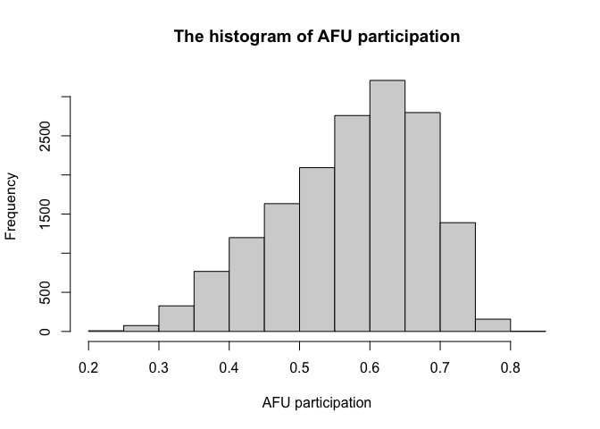
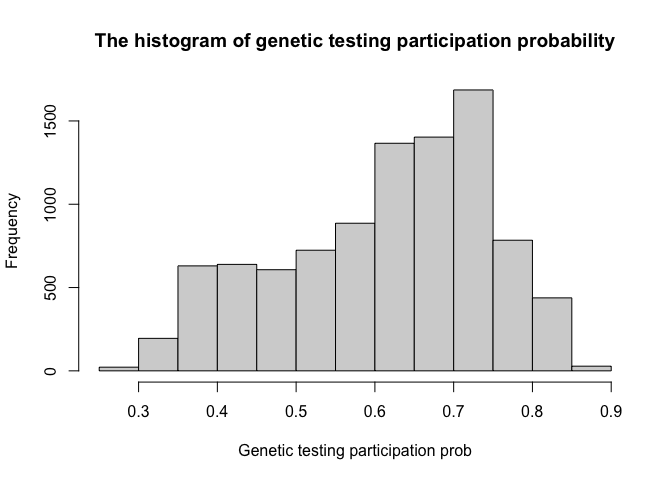
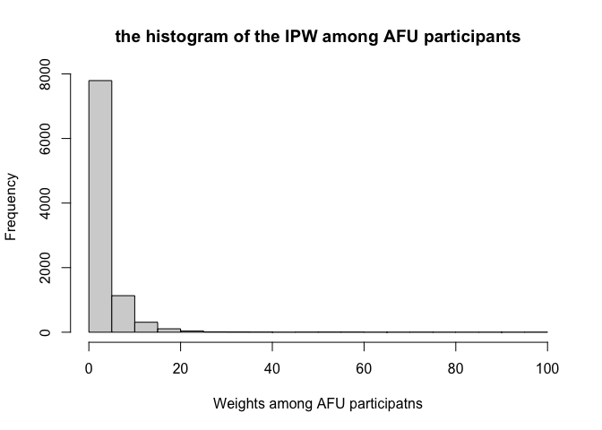

# Set up working directory and packages


```r
library(tidyverse)
library(survey)
library(plyr)
library(dplyr)
library(factoextra)
library(labelled)
library(tableone)
library(memisc)
library(sjlabelled)
library(mi)
library(boot)
```


```r
 base_path <- "~/Dropbox (Partners HealthCare)/SOL_misc_genetics/survey_gen_test_utilization/20210917_data_code/"
imputed_visit1_data_file <- paste0(base_path,"Processed_data/20210917_visit1_imputed_data.RData")
imputed_data_file_updated_vis2 <- paste0(base_path,"Processed_data/20210918_imputed_data_updated_from_vis2.RData")

covariates_data_file_vis1 <- paste0(base_path,"Processed_data/20210917_organized_visit1_covariates.RData")
covariates_data_file_vis2 <- paste0(base_path,"Processed_data/20210918_organized_covariates_updated_from_vis2.RData")
```


# Overview
This code is to generate IWP for the genetic testing survey. 
Only a subset of HCHS/SOL individuals who participated in visit 1, participated in the genetic testing survey. We cannot use visit 2 weights, because some of the people who participated in the genetic testing survey, did not participate in visit 2.
Therefore, we estimate the probability of participating in the genetic testing survey 
as follows: 
1. Estimate the probability of participating in the annual follow up phone call (AFU) of 2019-2020, given that individual participated in HCHS/SOL visit 1. 
2. Estimate the probability of responding to the genetic testing survey, given that an individual participated in the AFU. 

In order to estimate the first set of probabilities, we use covariates from visit 1. To estimate the second set of probabilities, we use covariates with updated values from visit 2 and also marital status from AFU year 2, when possible. There ware sporadic missingness, so we used the imputed datasets created in the previous reports. 


## Load the genetic testing survey dataset
 

```r
# read the genetic testing survey data: 
survey_gen <- read.csv(paste0(base_path, "/Preprocessed_data/solfu_gte_20200730.csv"))

# remove rows with data from afu_year =2 
survey_gen <- survey_gen[-which(survey_gen$AFU_YEAR==2),]

# create a variable that indicates whether a participate responded to the genetic testing survey according to the response to the awareness questions
survey_gen$aware <- NA
survey_gen$aware[which(survey_gen$GTE1 == 1 | 
                         survey_gen$GTE2 == 1 | 
                         survey_gen$GTE3 == 1 | 
                         survey_gen$GTE4 == 1)] <- 1
survey_gen$aware[which(is.na(survey_gen$aware) & 
                         (survey_gen$GTE1 == 0 | 
                         survey_gen$GTE2 == 0 | 
                         survey_gen$GTE3 == 0 | 
                         survey_gen$GTE4 == 0))] <- 0

survey_gen$gte_par <- NA
survey_gen$gte_par[which(survey_gen$aware == 0 | survey_gen$aware == 1)] <- 1 
```
In the survey data, there are 9716 rows, corresponding to  9408 individuals. Of these, 5769 responded to the survey.

## Setting variables to be used in IPW computation


```r
predictors <- c("age_cat",
                             "SEX",
                             "Education",
                             "CENTER",
                             "Income_level",
                             "Current_Health_insurance",
                             "Physician_Visit",
                             "Background", 
                             "Language_pref", 
                             "Marital_status",
                             "Employment_status", 
                             "US_BORN",
                             "STRAT")
```


# Step 1: compute probabilities of participation in the AFU

## Load the imputed dataset and covariates based on visit 1
Load the imputed data, then also add the status of participation in AFU.

```r
imputed_data <- readRDS(imputed_visit1_data_file)
imputed_data$AFU_par <- ifelse(is.element(imputed_data$ID, survey_gen$ID), 1, 0 )
```


Of 16415 HCHS/SOL participants, 9408 participated in the AFU, and 7007 did not. 


## logistic regression on participating annual follow up after the imputation.
After 5 rounds of imputation, missing values in variables age_cat, SEX, Education, CENTER, Income_level, Current_Health_insurance, Physician_Visit, Background, Language_pref, Marital_status, Employment_status, US_BORN, STRAT have been imputed. Afterwards, we create 5 datasets, which include all variables imputed for each time. 
In the logistic regression, the outcome is the dummy variable that indicates if the observation participates the annual follow-up.
We apply the logistic regression 5 times and each with the imputed variables respectively. After 5 times of logistic regression, we compute linear predictors $X*\beta$ and then average them to be a single $y_{ave}$. Then, the probability of AFU is calculated as 
$$
P_{AFU|SOL}=\frac{exp(y_{ave})}{1+exp(y_{ave})}
$$


```r
# 
n_imp <- 5

# prepare matrix to keep fits from each model
model_fits <- matrix(NA, nrow = nrow(imputed_data), ncol = n_imp)
for (i in 1:n_imp){
  if (i == 1){
    mod <- glm(as.formula(paste0("AFU_par~", paste(predictors, collapse = "+"))), data=imputed_data , family = "binomial")
    model_fits[,i] <- predict(mod,imputed_data[,predictors])
  } else{
    cur_predictors <- paste0(predictors, ".", i-1)
     mod <- glm(as.formula(paste0("AFU_par~", paste(cur_predictors, collapse = "+"))), data=imputed_data , family = "binomial")
    model_fits[,i] <- predict(mod,imputed_data[,cur_predictors])
  }
  
}


#average the X*beta and inverse of logit
imputed_data$prob_AFU <- inv.logit(rowMeans(model_fits))
hist(imputed_data$prob_AFU,main = "The histogram of AFU participation",xlab="AFU participation")
```

<!-- -->

```r
# add these probabilities to the dataset of covariates from visit 1
covars_vis1 <- readRDS(covariates_data_file_vis1)
covars_vis1 <- merge(covars_vis1, imputed_data[,c("ID", "prob_AFU")], by = "ID")
saveRDS(covars_vis1, paste0(base_path,"Processed_data/20210918_organized_visit1_covariates_with_prob_AFU.RData"))
```

# Step 2: compute probabilities of participation in the survey among AFU participants

## Load the imputed dataset with visit 2-updated covariates values


```r
imputed_data_AFU <- readRDS(imputed_data_file_updated_vis2)
nrow(imputed_data_AFU)
```

```
## [1] 9408
```

```r
gte_par_ids <- unique(survey_gen$ID[which(survey_gen$gte_par == 1)])
imputed_data_AFU$gte_par <- ifelse(is.element(imputed_data_AFU$ID, gte_par_ids), 1, 0 )
sum(imputed_data_AFU$gte_par)
```

```
## [1] 5769
```


Of 9408 AFU participants, 5769 responded to the genetic testing survey, and 3639 did not. 


## Logistic regression on responding to the genetic survey
This logistic regression follows the same pattern of the previous logistic regression. Five regressions are applied with imputed variables of each time imputation respectively.
we compute linear predictors $X*\beta$ and then averaged them to be a single $y_{ave}$. Then, the probability of participating in the genetic testing survey is calculated as 
$$
P_{GTS|AFU}=\frac{exp(y_{ave})}{1+exp(y_{ave})}
$$
After the $P_{GTS|AFU}$ is obtained, $\frac{1}{P_{GTS}}$ can be computed as 
$$
\frac{1}{P_{GTS}}=\frac{1}{P_{GTS|AFU}}*\frac{1}{P_{AFU|SOL}}*\frac{1}{P_{SOL}}
$$
The weights $\frac{1}{P_{SOL}}$ were computed by the Data Coordinating Center of the HCHS/SOL for all HCHS/SOL participants.


For computing the probabilities $P_{GTS|AFU}$, we use age based on participation in the AFU, in addition to other values of covariates that were updated from visit 2 when possible. 


```r
n_imp <- 5

# prepare matrix to keep fits from each model
model_fits <- matrix(NA, nrow = nrow(imputed_data_AFU), ncol = n_imp)
for (i in 1:n_imp){
  if (i == 1){
    mod <- glm(as.formula(paste0("gte_par~", paste(predictors, collapse = "+"))), data=imputed_data_AFU , family = "binomial")
    model_fits[,i] <- predict(mod,imputed_data_AFU[,predictors])
  } else{
    cur_predictors <- paste0(predictors, ".", i-1)
     mod <- glm(as.formula(paste0("gte_par~", paste(cur_predictors, collapse = "+"))), data=imputed_data_AFU , family = "binomial")
    model_fits[,i] <- predict(mod,imputed_data_AFU[,cur_predictors])
  }
  
}


#average the X*beta and inverse of logit
imputed_data_AFU$prob_gte <- inv.logit(rowMeans(model_fits))
hist(imputed_data_AFU$prob_gte,main = "The histogram of genetic testing participation probability",xlab="Genetic testing participation prob")
```

<!-- -->

```r
# add these probabilities to the dataset of covariates used for AFU 
covars_vis2 <- readRDS(covariates_data_file_vis2)
covars_vis2 <- merge(covars_vis2, imputed_data_AFU[,c("ID","gte_par", "prob_gte")], by = "ID")

# also add the probability of participating in the AFU:
covars_vis2 <- merge(covars_vis2, covars_vis1[,c("ID", "prob_AFU")], by = "ID")
dim(covars_vis2)
```

```
## [1] 9408   59
```

```r
# compute IPW:
covars_vis2$IPW <- covars_vis2$WEIGHT_FINAL_NORM_OVERALL*
                          (1/covars_vis2$prob_AFU)*
                          (1/covars_vis2$prob_gte) 

hist(covars_vis2$IPW,main="the histogram of the IPW among AFU participants",xlab="Weights among AFU participatns")
```

<!-- -->

```r
saveRDS(covars_vis2, paste0(base_path,"Processed_data/20210918_organized_visit2_covariates_with_probs_IPW.RData"))
```

# Merge datasets to have a dataset of only genetic survey testing participants
The dataset includes the responses to the genetic testing survey, covariates, and weights.


```r
covariates_gte <- covars_vis2[which(covars_vis2$gte_par == 1),]
covariates_gte <-covariates_gte[,c("ID", 
                                "PSU_ID", 
                                 predictors,
                                    "IPW")]

survey_gen <- survey_gen[which(survey_gen$gte_par == 1),]
# we have some non-unique rows in term of participants. For the same person, we choose the response with less missing values. 
questions <- c("GTE1", "GTE2", "GTE3", "GTE4",
               "GTE1A", "GTE1B", "GTE1C",
               "GTE2A", "GTE2B", "GTE2C",
               "GTE3A", "GTE3B", "GTE3C",
               "GTE4A", "GTE4B", "GTE4C",
               "GTE5")
duplicated_rows <- which(duplicated(survey_gen$ID))
for (i in rev(duplicated_rows)){
  cur_non_nas <- sum(!is.na(survey_gen[i,questions]))
  cur_non_nas_prev_row <- sum(!is.na(survey_gen[i-1,questions]))
  if (cur_non_nas > cur_non_nas_prev_row){
    survey_gen <- survey_gen[-i,]
  } else{
    survey_gen <- survey_gen[-(i-1),]
  }
}

# merge datasets:
data <- merge(covariates_gte, survey_gen[,c("ID", questions)], by = "ID")

data$AGE <- as.factor(data$age_cat)
data$age_cat <-  NULL

saveRDS(data,paste0(base_path,"/Processed_data/20210918_gte_data_set_with_covariates_and_IPW.RData"))
```
 Verify dimension of the data:
 
 ```r
 dim(data)
 ```
 
 ```
 ## [1] 5769   33
 ```
 
 ```r
 colnames(data)
 ```
 
 ```
 ##  [1] "ID"                      
 ##  [2] "PSU_ID"                  
 ##  [3] "SEX"                     
 ##  [4] "Education"               
 ##  [5] "CENTER"                  
 ##  [6] "Income_level"            
 ##  [7] "Current_Health_insurance"
 ##  [8] "Physician_Visit"         
 ##  [9] "Background"              
 ## [10] "Language_pref"           
 ## [11] "Marital_status"          
 ## [12] "Employment_status"       
 ## [13] "US_BORN"                 
 ## [14] "STRAT"                   
 ## [15] "IPW"                     
 ## [16] "GTE1"                    
 ## [17] "GTE2"                    
 ## [18] "GTE3"                    
 ## [19] "GTE4"                    
 ## [20] "GTE1A"                   
 ## [21] "GTE1B"                   
 ## [22] "GTE1C"                   
 ## [23] "GTE2A"                   
 ## [24] "GTE2B"                   
 ## [25] "GTE2C"                   
 ## [26] "GTE3A"                   
 ## [27] "GTE3B"                   
 ## [28] "GTE3C"                   
 ## [29] "GTE4A"                   
 ## [30] "GTE4B"                   
 ## [31] "GTE4C"                   
 ## [32] "GTE5"                    
 ## [33] "AGE"
 ```

# Package versions

```r
sessionInfo()
```

```
## R version 4.0.3 (2020-10-10)
## Platform: x86_64-apple-darwin17.0 (64-bit)
## Running under: macOS Catalina 10.15.7
## 
## Matrix products: default
## BLAS:   /System/Library/Frameworks/Accelerate.framework/Versions/A/Frameworks/vecLib.framework/Versions/A/libBLAS.dylib
## LAPACK: /Library/Frameworks/R.framework/Versions/4.0/Resources/lib/libRlapack.dylib
## 
## locale:
## [1] en_US.UTF-8/en_US.UTF-8/en_US.UTF-8/C/en_US.UTF-8/en_US.UTF-8
## 
## attached base packages:
## [1] stats4    grid      stats     graphics  grDevices
## [6] utils     datasets  methods   base     
## 
## other attached packages:
##  [1] rmarkdown_2.7    boot_1.3-27      mi_1.0          
##  [4] sjlabelled_1.1.7 memisc_0.99.27.3 MASS_7.3-53.1   
##  [7] lattice_0.20-41  tableone_0.12.0  labelled_2.8.0  
## [10] factoextra_1.0.7 plyr_1.8.6       survey_4.0      
## [13] survival_3.2-9   Matrix_1.3-2     forcats_0.5.1   
## [16] stringr_1.4.0    dplyr_1.0.5      purrr_0.3.4     
## [19] readr_1.4.0      tidyr_1.1.3      tibble_3.1.0    
## [22] ggplot2_3.3.3    tidyverse_1.3.0 
## 
## loaded via a namespace (and not attached):
##  [1] nlme_3.1-152        fs_1.5.0           
##  [3] lubridate_1.7.10    insight_0.13.1     
##  [5] RColorBrewer_1.1-2  httr_1.4.2         
##  [7] repr_1.1.3          bslib_0.2.4        
##  [9] tools_4.0.3         backports_1.2.1    
## [11] utf8_1.2.1          R6_2.5.0           
## [13] rpart_4.1-15        Hmisc_4.5-0        
## [15] DBI_1.1.1           colorspace_2.0-0   
## [17] nnet_7.3-15         withr_2.4.1        
## [19] gridExtra_2.3       tidyselect_1.1.0   
## [21] curl_4.3            compiler_4.0.3     
## [23] cli_3.0.1           rvest_1.0.0        
## [25] htmlTable_2.1.0     xml2_1.3.2         
## [27] sass_0.3.1          checkmate_2.0.0    
## [29] scales_1.1.1        digest_0.6.27      
## [31] minqa_1.2.4         foreign_0.8-81     
## [33] rio_0.5.26          base64enc_0.1-3    
## [35] jpeg_0.1-8.1        pkgconfig_2.0.3    
## [37] htmltools_0.5.1.1   lme4_1.1-26        
## [39] highr_0.8           dbplyr_2.1.0       
## [41] htmlwidgets_1.5.3   rlang_0.4.10       
## [43] readxl_1.3.1        rstudioapi_0.13    
## [45] jquerylib_0.1.3     generics_0.1.0     
## [47] jsonlite_1.7.2      zip_2.1.1          
## [49] car_3.0-10          magrittr_2.0.1     
## [51] Formula_1.2-4       Rcpp_1.0.6         
## [53] munsell_0.5.0       fansi_0.4.2        
## [55] abind_1.4-5         lifecycle_1.0.0    
## [57] stringi_1.5.3       yaml_2.2.1         
## [59] carData_3.0-4       parallel_4.0.3     
## [61] ggrepel_0.9.1       crayon_1.4.1       
## [63] haven_2.3.1         splines_4.0.3      
## [65] hms_1.0.0           knitr_1.31         
## [67] pillar_1.5.1        reprex_1.0.0       
## [69] glue_1.4.2          evaluate_0.14      
## [71] mitools_2.4         latticeExtra_0.6-29
## [73] data.table_1.14.0   modelr_0.1.8       
## [75] nloptr_1.2.2.2      vctrs_0.3.6        
## [77] png_0.1-7           cellranger_1.1.0   
## [79] gtable_0.3.0        assertthat_0.2.1   
## [81] xfun_0.22           openxlsx_4.2.3     
## [83] broom_0.7.8         coda_0.19-4        
## [85] arm_1.11-2          cluster_2.1.1      
## [87] statmod_1.4.35      ellipsis_0.3.1
```


