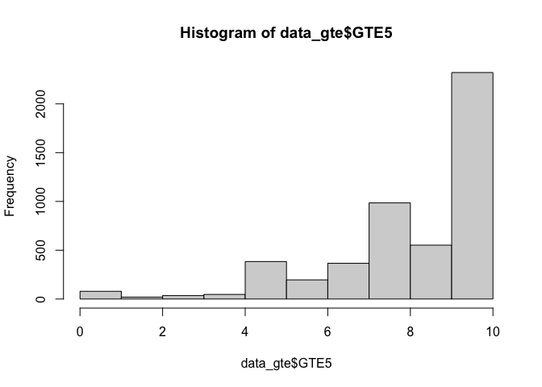

```r
library(tidyverse)
library(survey)
library(plyr)
library(dplyr)
library(factoextra)
library(labelled)
library(tableone)
library(memisc)
library(jtools)
library(Publish)
library(gtsummary)
library(flextable)
```


# Setting up working directory

```r
base_path <- "~/Dropbox (Partners HealthCare)/SOL_misc_genetics/survey_gen_test_utilization/20210917_data_code/"
data_file <- paste0(base_path, "Processed_data/20210918_gte_data_set_with_covariates_and_IPW.RData")
output_dir <- paste0(base_path, "Results")
```

# Load the data and weight it with IPW (trim the weight at 30)


```r
data_gte <- readRDS(data_file)
nrow(data_gte)
```

```
## [1] 5769
```

```r
hist(data_gte$GTE5)
```

<!-- -->

```r
survey_gte <- svydesign(id=~PSU_ID, strata=~STRAT, weights=~IPW , data=data_gte)
survey_trim <- trimWeights(survey_gte,upper = 30)
```
There are `{r sum(is.na(data_gte$GTE5))}` missing values in the response to the perceived utility question. 


# Perform possion regression of percieved utility.
The responses to the perceived utility question are roughly log-normal. We use Poisson regression, modeling multiplicative effects of the covariates. 


```r
model_utility <- svyglm(GTE5~AGE+SEX+Education+CENTER+Income_level+Current_Health_insurance+Physician_Visit+Background+Language_pref+Marital_status+Employment_status+US_BORN,design=survey_trim,na.action=na.omit,family=quasipoisson())
summary(model_utility)
```

```
## 
## Call:
## svyglm(formula = GTE5 ~ AGE + SEX + Education + CENTER + Income_level + 
##     Current_Health_insurance + Physician_Visit + Background + 
##     Language_pref + Marital_status + Employment_status + US_BORN, 
##     design = survey_trim, family = quasipoisson(), na.action = na.omit)
## 
## Survey design:
## trimWeights(survey_gte, upper = 30)
## 
## Coefficients:
##                                                        Estimate
## (Intercept)                                           2.0906079
## AGE41-60                                              0.0255369
## AGE61<                                               -0.0203141
## SEXMale                                              -0.0226537
## Education12                                          -0.0049268
## Education>12                                          0.0086959
## CENTERChicago                                         0.0077344
## CENTERMiami                                           0.0657378
## CENTERSan Diego                                       0.0282997
## Income_level$10,001-$20,000                           0.0135599
## Income_level$20,001-$40,000                           0.0119647
## Income_level$40,001-$75,000                           0.0353009
## Income_levelMore than $75,000                        -0.0134160
## Current_Health_insuranceYes                           0.0002604
## Physician_VisitOne or two times                       0.0047428
## Physician_VisitAt least three times                   0.0050257
## BackgroundCentral American                           -0.0002222
## BackgroundCuban                                       0.0282901
## BackgroundMexican                                    -0.0096782
## BackgroundPuerto Rican                               -0.0032543
## BackgroundSouth American                             -0.0087417
## BackgroundMore than one/Other heritage               -0.0006193
## Language_prefEnglish                                 -0.0516706
## Marital_statusMarried or living with a partner        0.0160787
## Marital_statusSeparated,divorced,or widow(er)         0.0217668
## Employment_statusEmployed part-time(<=35 hours/week)  0.0230442
## Employment_statusEmployed full-time(>35 hours/week)  -0.0017067
## US_BORNYes                                           -0.0430691
##                                                      Std. Error
## (Intercept)                                           0.0299317
## AGE41-60                                              0.0143052
## AGE61<                                                0.0164464
## SEXMale                                               0.0111496
## Education12                                           0.0163993
## Education>12                                          0.0130751
## CENTERChicago                                         0.0260658
## CENTERMiami                                           0.0238205
## CENTERSan Diego                                       0.0313815
## Income_level$10,001-$20,000                           0.0244107
## Income_level$20,001-$40,000                           0.0233861
## Income_level$40,001-$75,000                           0.0239355
## Income_levelMore than $75,000                         0.0288779
## Current_Health_insuranceYes                           0.0126732
## Physician_VisitOne or two times                       0.0144729
## Physician_VisitAt least three times                   0.0136194
## BackgroundCentral American                            0.0254303
## BackgroundCuban                                       0.0281382
## BackgroundMexican                                     0.0342807
## BackgroundPuerto Rican                                0.0257553
## BackgroundSouth American                              0.0278777
## BackgroundMore than one/Other heritage                0.0335278
## Language_prefEnglish                                  0.0177962
## Marital_statusMarried or living with a partner        0.0156815
## Marital_statusSeparated,divorced,or widow(er)         0.0163505
## Employment_statusEmployed part-time(<=35 hours/week)  0.0133107
## Employment_statusEmployed full-time(>35 hours/week)   0.0130685
## US_BORNYes                                            0.0163001
##                                                      t value
## (Intercept)                                           69.846
## AGE41-60                                               1.785
## AGE61<                                                -1.235
## SEXMale                                               -2.032
## Education12                                           -0.300
## Education>12                                           0.665
## CENTERChicago                                          0.297
## CENTERMiami                                            2.760
## CENTERSan Diego                                        0.902
## Income_level$10,001-$20,000                            0.555
## Income_level$20,001-$40,000                            0.512
## Income_level$40,001-$75,000                            1.475
## Income_levelMore than $75,000                         -0.465
## Current_Health_insuranceYes                            0.021
## Physician_VisitOne or two times                        0.328
## Physician_VisitAt least three times                    0.369
## BackgroundCentral American                            -0.009
## BackgroundCuban                                        1.005
## BackgroundMexican                                     -0.282
## BackgroundPuerto Rican                                -0.126
## BackgroundSouth American                              -0.314
## BackgroundMore than one/Other heritage                -0.018
## Language_prefEnglish                                  -2.903
## Marital_statusMarried or living with a partner         1.025
## Marital_statusSeparated,divorced,or widow(er)          1.331
## Employment_statusEmployed part-time(<=35 hours/week)   1.731
## Employment_statusEmployed full-time(>35 hours/week)   -0.131
## US_BORNYes                                            -2.642
##                                                      Pr(>|t|)
## (Intercept)                                           < 2e-16
## AGE41-60                                              0.07479
## AGE61<                                                0.21730
## SEXMale                                               0.04266
## Education12                                           0.76396
## Education>12                                          0.50628
## CENTERChicago                                         0.76679
## CENTERMiami                                           0.00598
## CENTERSan Diego                                       0.36756
## Income_level$10,001-$20,000                           0.57879
## Income_level$20,001-$40,000                           0.60913
## Income_level$40,001-$75,000                           0.14083
## Income_levelMore than $75,000                         0.64242
## Current_Health_insuranceYes                           0.98362
## Physician_VisitOne or two times                       0.74326
## Physician_VisitAt least three times                   0.71226
## BackgroundCentral American                            0.99303
## BackgroundCuban                                       0.31515
## BackgroundMexican                                     0.77780
## BackgroundPuerto Rican                                0.89950
## BackgroundSouth American                              0.75397
## BackgroundMore than one/Other heritage                0.98527
## Language_prefEnglish                                  0.00384
## Marital_statusMarried or living with a partner        0.30566
## Marital_statusSeparated,divorced,or widow(er)         0.18366
## Employment_statusEmployed part-time(<=35 hours/week)  0.08397
## Employment_statusEmployed full-time(>35 hours/week)   0.89614
## US_BORNYes                                            0.00847
##                                                         
## (Intercept)                                          ***
## AGE41-60                                             .  
## AGE61<                                                  
## SEXMale                                              *  
## Education12                                             
## Education>12                                            
## CENTERChicago                                           
## CENTERMiami                                          ** 
## CENTERSan Diego                                         
## Income_level$10,001-$20,000                             
## Income_level$20,001-$40,000                             
## Income_level$40,001-$75,000                             
## Income_levelMore than $75,000                           
## Current_Health_insuranceYes                             
## Physician_VisitOne or two times                         
## Physician_VisitAt least three times                     
## BackgroundCentral American                              
## BackgroundCuban                                         
## BackgroundMexican                                       
## BackgroundPuerto Rican                                  
## BackgroundSouth American                                
## BackgroundMore than one/Other heritage                  
## Language_prefEnglish                                 ** 
## Marital_statusMarried or living with a partner          
## Marital_statusSeparated,divorced,or widow(er)           
## Employment_statusEmployed part-time(<=35 hours/week) .  
## Employment_statusEmployed full-time(>35 hours/week)     
## US_BORNYes                                           ** 
## ---
## Signif. codes:  
## 0 '***' 0.001 '**' 0.01 '*' 0.05 '.' 0.1 ' ' 1
## 
## (Dispersion parameter for quasipoisson family taken to be 0.4748969)
## 
## Number of Fisher Scoring iterations: 4
```

Summarize in a nice table

```r
tbl_utility <- tbl_regression(model_utility, exponentiate = TRUE)
tbl_utility %>%
  as_flex_table() %>%
  flextable::save_as_docx(path = paste0(output_dir, "/20210918_utility_poisson_reg.docx"))
```

# Secondary analysis: stratify by center
This analysis will allow others, if interested, to check whether some results seem to be driven by a specific center (though not to test this hypothesis).


```r
subset_site <- subset(survey_trim, CENTER == "Miami")
model_miami <- svyglm(GTE5~AGE+SEX+Education+Income_level+Current_Health_insurance+Physician_Visit+Background+Language_pref+Marital_status+Employment_status+US_BORN,design=subset_site,na.action=na.omit,family=quasipoisson())

subset_site <- subset(survey_trim, CENTER == "Bronx")
model_bronx <- svyglm(GTE5~AGE+SEX+Education+Income_level+Current_Health_insurance+Physician_Visit+Background+Language_pref+Marital_status+Employment_status+US_BORN,design=subset_site,na.action=na.omit,family=quasipoisson())

subset_site <- subset(survey_trim, CENTER == "San Diego")
model_sandiego <- svyglm(GTE5~AGE+SEX+Education+Income_level+Current_Health_insurance+Physician_Visit+Background+Language_pref+Marital_status+Employment_status+US_BORN,design=subset_site,na.action=na.omit,family=quasipoisson())

subset_site <- subset(survey_trim, CENTER == "Chicago")
model_chicago <- svyglm(GTE5~AGE+SEX+Education+Income_level+Current_Health_insurance+Physician_Visit+Background+Language_pref+Marital_status+Employment_status+US_BORN,design=subset_site,na.action=na.omit,family=quasipoisson())

# merge results and prepare a combined table:

tbl_miami <- tbl_regression(model_miami, exponentiate = TRUE)
tbl_chicago <- tbl_regression(model_chicago, exponentiate = TRUE)
tbl_bronx <- tbl_regression(model_bronx, exponentiate = TRUE)
tbl_sandiego <- tbl_regression(model_sandiego, exponentiate = TRUE)

tbl_merge_center <-
  tbl_merge(
    tbls = list(tbl_bronx, tbl_chicago, tbl_miami, tbl_sandiego),
    tab_spanner = c("**Bronx**", 
                    "**Chicago**", 
                    "**Miami**",
                    "**San Diego**")
  )

ftbl_merge_center <- as_flex_table(tbl_merge_center)


ftbl_merge_center_w <- FitFlextableToPage(ftbl_merge_center)
flextable::save_as_docx(ftbl_merge_center_w, path = paste0(output_dir, "/20210918_perceived utility_reg_by_center.docx"))
```


# Secondary analysis: stratify by center
This analysis will allow others, if interested, to check whether some results seem to be driven by a specific center (though not to test this hypothesis).


```r
subset_sex <- subset(survey_trim, SEX == "Female")
model_female <- svyglm(GTE5~AGE+Education+CENTER+Income_level+Current_Health_insurance+Physician_Visit+Background+Language_pref+Marital_status+Employment_status+US_BORN,design=subset_sex,na.action=na.omit,family=quasipoisson())

subset_sex <- subset(survey_trim, SEX == "Male")
model_male <- svyglm(GTE5~AGE+Education+CENTER+Income_level+Current_Health_insurance+Physician_Visit+Background+Language_pref+Marital_status+Employment_status+US_BORN,design=subset_sex,na.action=na.omit,family=quasipoisson())


tbl_female <- tbl_regression(model_female, exponentiate = TRUE)
tbl_male <- tbl_regression(model_male, exponentiate = TRUE)

tbl_merge_sex <-
  tbl_merge(
    tbls = list(tbl_female, tbl_male),
    tab_spanner = c("**Women**", 
                    "**Men**")
  )

ftbl_merge_sex <- as_flex_table(tbl_merge_sex)


ftbl_merge_sex_w <- FitFlextableToPage(ftbl_merge_sex)
flextable::save_as_docx(ftbl_merge_sex_w, path = paste0(output_dir, "/20210918_perceived_utility_reg_by_gender.docx"))
```


```r
sessionInfo()
```

```
## R version 4.0.3 (2020-10-10)
## Platform: x86_64-apple-darwin17.0 (64-bit)
## Running under: macOS Catalina 10.15.7
## 
## Matrix products: default
## BLAS:   /System/Library/Frameworks/Accelerate.framework/Versions/A/Frameworks/vecLib.framework/Versions/A/libBLAS.dylib
## LAPACK: /Library/Frameworks/R.framework/Versions/4.0/Resources/lib/libRlapack.dylib
## 
## locale:
## [1] en_US.UTF-8/en_US.UTF-8/en_US.UTF-8/C/en_US.UTF-8/en_US.UTF-8
## 
## attached base packages:
## [1] stats4    grid      stats     graphics 
## [5] grDevices utils     datasets  methods  
## [9] base     
## 
## other attached packages:
##  [1] flextable_0.6.6    gtsummary_1.4.2   
##  [3] Publish_2020.12.23 prodlim_2019.11.13
##  [5] jtools_2.1.3       rmarkdown_2.7     
##  [7] boot_1.3-27        mi_1.0            
##  [9] sjlabelled_1.1.7   memisc_0.99.27.3  
## [11] MASS_7.3-53.1      lattice_0.20-41   
## [13] tableone_0.12.0    labelled_2.8.0    
## [15] factoextra_1.0.7   plyr_1.8.6        
## [17] survey_4.0         survival_3.2-9    
## [19] Matrix_1.3-2       forcats_0.5.1     
## [21] stringr_1.4.0      dplyr_1.0.5       
## [23] purrr_0.3.4        readr_1.4.0       
## [25] tidyr_1.1.3        tibble_3.1.0      
## [27] ggplot2_3.3.3      tidyverse_1.3.0   
## 
## loaded via a namespace (and not attached):
##  [1] minqa_1.2.4         colorspace_2.0-0   
##  [3] ellipsis_0.3.1      rio_0.5.26         
##  [5] htmlTable_2.1.0     base64enc_0.1-3    
##  [7] fs_1.5.0            rstudioapi_0.13    
##  [9] ggrepel_0.9.1       fansi_0.4.2        
## [11] lubridate_1.7.10    xml2_1.3.2         
## [13] splines_4.0.3       knitr_1.31         
## [15] Formula_1.2-4       jsonlite_1.7.2     
## [17] nloptr_1.2.2.2      gt_0.3.0           
## [19] broom_0.7.8         cluster_2.1.1      
## [21] dbplyr_2.1.0        png_0.1-7          
## [23] compiler_4.0.3      httr_1.4.2         
## [25] backports_1.2.1     assertthat_0.2.1   
## [27] cli_3.0.1           htmltools_0.5.1.1  
## [29] tools_4.0.3         coda_0.19-4        
## [31] gtable_0.3.0        glue_1.4.2         
## [33] Rcpp_1.0.6          carData_3.0-4      
## [35] cellranger_1.1.0    jquerylib_0.1.3    
## [37] vctrs_0.3.6         nlme_3.1-152       
## [39] broom.helpers_1.3.0 insight_0.13.1     
## [41] xfun_0.22           openxlsx_4.2.3     
## [43] lme4_1.1-26         rvest_1.0.0        
## [45] lifecycle_1.0.0     statmod_1.4.35     
## [47] zoo_1.8-9           scales_1.1.1       
## [49] hms_1.0.0           parallel_4.0.3     
## [51] RColorBrewer_1.1-2  yaml_2.2.1         
## [53] curl_4.3            gridExtra_2.3      
## [55] pander_0.6.3        gdtools_0.2.3      
## [57] sass_0.3.1          rpart_4.1-15       
## [59] latticeExtra_0.6-29 stringi_1.5.3      
## [61] highr_0.8           checkmate_2.0.0    
## [63] zip_2.1.1           lava_1.6.9         
## [65] repr_1.1.3          systemfonts_1.0.1  
## [67] rlang_0.4.10        pkgconfig_2.0.3    
## [69] arm_1.11-2          evaluate_0.14      
## [71] htmlwidgets_1.5.3   tidyselect_1.1.0   
## [73] magrittr_2.0.1      R6_2.5.0           
## [75] generics_0.1.0      Hmisc_4.5-0        
## [77] DBI_1.1.1           pillar_1.5.1       
## [79] haven_2.3.1         foreign_0.8-81     
## [81] withr_2.4.1         abind_1.4-5        
## [83] nnet_7.3-15         modelr_0.1.8       
## [85] crayon_1.4.1        car_3.0-10         
## [87] uuid_0.1-4          utf8_1.2.1         
## [89] officer_0.3.18      jpeg_0.1-8.1       
## [91] readxl_1.3.1        data.table_1.14.0  
## [93] reprex_1.0.0        digest_0.6.27      
## [95] munsell_0.5.0       bslib_0.2.4        
## [97] mitools_2.4
```

