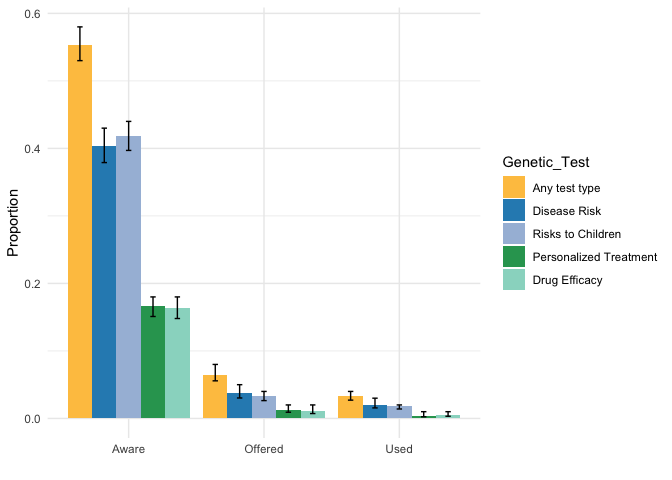
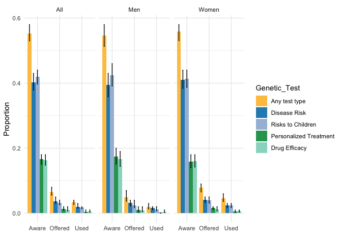
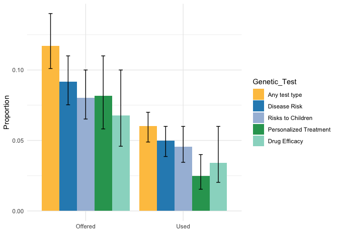

```r
library(tidyverse)
library(survey)
library(plyr)
library(dplyr)
library(factoextra)
library(labelled)
library(tableone)
library(memisc)
library(jtools)
library(Publish)
```

# Setting up working directory

```r
base_path <- "~/Dropbox (Partners HealthCare)/SOL_misc_genetics/survey_gen_test_utilization/20221003_data_code/"
data_file <- paste0(base_path, "Processed_data/gte_data_set_with_covariates_and_IPW.RData")
output_dir <- paste0(base_path, "Results")
```


# read the data and format variables as necessary


```r
data_gte <- readRDS(data_file)


# change "refuse to respond" to the individual awareness items to 0:
data_gte$GTE1[which(data_gte$GTE1 == 9)] <- 0
data_gte$GTE2[which(data_gte$GTE2 == 9)] <- 0
data_gte$GTE3[which(data_gte$GTE3 == 9)] <- 0
data_gte$GTE4[which(data_gte$GTE4 == 9)] <- 0

# change anything that is not 1 or 0 in response to "offered" and "used" questions to 0:
data_gte$GTE1A[which(!is.element(data_gte$GTE1A, c(0,1)))] <- 0
data_gte$GTE2A[which(!is.element(data_gte$GTE2A, c(0,1)))] <- 0
data_gte$GTE3A[which(!is.element(data_gte$GTE3A, c(0,1)))] <- 0
data_gte$GTE4A[which(!is.element(data_gte$GTE4A, c(0,1)))] <- 0

data_gte$GTE1B[which(!is.element(data_gte$GTE1B, c(0,1)))] <- 0
data_gte$GTE2B[which(!is.element(data_gte$GTE2B, c(0,1)))] <- 0
data_gte$GTE3B[which(!is.element(data_gte$GTE3B, c(0,1)))] <- 0
data_gte$GTE4B[which(!is.element(data_gte$GTE4B, c(0,1)))] <- 0

# add composite responses:

# aware:
data_gte$aware <- NA
data_gte$aware[which(data_gte$GTE1 == 1 | 
                         data_gte$GTE2 == 1 | 
                         data_gte$GTE3 == 1 | 
                         data_gte$GTE4 == 1)] <- 1
data_gte$aware[which(is.na(data_gte$aware) & 
                         (data_gte$GTE1 == 0 | 
                         data_gte$GTE2 == 0 | 
                         data_gte$GTE3 == 0 | 
                         data_gte$GTE4 == 0))] <- 0

# offered:
data_gte$offered <- 0
data_gte$offered[which(data_gte$GTE1A == "1" | 
                         data_gte$GTE2A == "1" | 
                         data_gte$GTE3A == "1" | 
                         data_gte$GTE4A == "1")] <- 1

# received:
data_gte$received <- 0
data_gte$received[which(data_gte$GTE1B == "1" | 
                         data_gte$GTE2B == "1" | 
                         data_gte$GTE3B == "1" | 
                         data_gte$GTE4B == "1")] <- 1

survey_gte <- svydesign(id=~PSU_ID, strata=~STRAT, weights=~IPW , data=data_gte)
survey_trim <- trimWeights(survey_gte,upper = 30)
```


# Compute proportions and SEs and print to file
The survey R package is a bit annoying, we cannot extract the SE of proportion estimates directly. So we write them to a file. 

First, set up the variable names and the files. We want to describe these results by gender as well, these will be in separate files. 

```r
vars <- c("aware", "offered","received",
          "GTE1","GTE1A","GTE1B",
          "GTE2","GTE2A","GTE2B",
          "GTE3","GTE3A","GTE3B",
          "GTE4","GTE4A","GTE4B")
gte_prop_commands_file_name <- paste0(output_dir, "/proportion_and_SEs_commands_among_", 
                                      c("all", "Females", "Males"), ".txt")
gte_prop_file_name <- paste0(output_dir, "/proportion_and_SEs_among_", 
                                      c("all", "Females", "Males"), ".txt")
names(gte_prop_commands_file_name) <- names(gte_prop_file_name) <- c("all", "f", "m")
```

Write information to files.

```r
# first we print the commands (otherwise we cannot efficiently loop through variables)
sink(gte_prop_commands_file_name[["all"]])
 for (cur_var in vars){
 
    line <- paste('print(svyciprop(~I(', cur_var, '==1),survey_trim,\"lo\"))')
    cat(line, "\n")
 
 }
 sink()

# now execute the commands and print results to file
sink(gte_prop_file_name[["all"]])
 source(gte_prop_commands_file_name[["all"]])
sink()

# now by gender groups
# First, women:
sink(gte_prop_commands_file_name[["f"]])
 for (cur_var in vars){
 
    line <- paste('print(svyciprop(~I(', cur_var, '==1),subset(survey_trim, SEX == \"Female\"),\"lo\"))')
    cat(line, "\n")
 
 }
 sink()

# now execute the commands and print results to file
sink(gte_prop_file_name[["f"]])
 source(gte_prop_commands_file_name[["f"]])
sink()

## In men:
sink(gte_prop_commands_file_name[["m"]])
 for (cur_var in vars){
 
    line <- paste('print(svyciprop(~I(', cur_var, '==1),subset(survey_trim, SEX == \"Male\"),\"lo\"))')
    cat(line, "\n")
 
 }
 sink()

# now execute the commands and print results to file
sink(gte_prop_file_name[["m"]])
 source(gte_prop_commands_file_name[["m"]])
sink()
```

Read and organize the data:

```r
# read the results from the file, first: everyone combined. 
bar_dat_list <- vector(mode = "list", length = 3)
groups <- c("all" , "f", "m")
names(bar_dat_list) <- groups

for (i in 1:3){
  group <- groups[i]
  bar_dat <- c()

  for (rownum in seq(from =2, to = length(vars)*2, by = 2)){
  bar_dat <- rbind(bar_dat, read.table(gte_prop_file_name[[group]], header = FALSE, 
                                       nrow =1, skip = rownum-1))
  }

  # organize
  bar_dat$question <- vars
  bar_dat$V1 <- bar_dat$V2 <- bar_dat$V3 <- NULL
  names(bar_dat)[1:3] <- c("Proportion", "Low_CI", "High_CI")
  bar_dat$Question <- rep(c("Aware","Offered","Used"),times=5)
   bar_dat$Genetic_Test <- c(rep("Any test type", 3), rep("Disease Risk",3),
                             rep("Risks to Children",3),
                             rep("Personalized Treatment",3),rep("Drug Efficacy",3))
  
  bar_dat$group <- group
  bar_dat_list[[group]] <- bar_dat
}
bar_dat_comb <- do.call(rbind, bar_dat_list)
bar_dat_comb$group[which(bar_dat_comb$group == "all")] <- "All"
bar_dat_comb$group[which(bar_dat_comb$group == "m")] <- "Men"
bar_dat_comb$group[which(bar_dat_comb$group == "f")] <- "Women"
```


# Generate the bar plot: all combined
 The x-axis is the 4 questions (and composite response) in the test and the y-axis is the proportions of response 'Yes'.
 There are 5 bars in each group (question) and they represent the 4 tests and the composite measure of any of the tests. 


```r
bar_dat_comb$Genetic_Test <- factor(bar_dat_comb$Genetic_Test,levels =c("Any test type", "Disease Risk","Risks to Children","Personalized Treatment","Drug Efficacy"), ordered = TRUE) 
p <- ggplot(bar_dat_comb[which(bar_dat_comb$group == "All"),], aes(x=Question, y=Proportion, fill=Genetic_Test)) + 
      geom_bar(stat="identity", position=position_dodge(0.9))+ 
      geom_errorbar(aes(ymin=Low_CI, ymax=High_CI), width=.2, position=position_dodge(.9)) +
      scale_fill_manual(values=c("#fec44f", "#2b8cbe","#a6bddb", "#2ca25f", "#99d8c9")) +
      theme_minimal() + xlab("")
p
```

<!-- -->

```r
ggsave(paste0(output_dir, "/proportion_of_all_pop_bars.pdf"),width=6,height = 4)
```


# Generate the bar plot: all combined, and by gender 
Another attempt at a figure with facets for each of the analyses (combined, males, females)


```r
p <- ggplot(bar_dat_comb, aes(x=Question, y=Proportion, fill=Genetic_Test)) + 
      geom_bar(stat="identity", position=position_dodge(0.9))+ 
      geom_errorbar(aes(ymin=Low_CI, ymax=High_CI), width=.2, position=position_dodge(.9)) +
      scale_fill_manual(values=c("#fec44f", "#2b8cbe","#a6bddb", "#2ca25f", "#99d8c9")) +
      theme_minimal() + xlab("")
p + facet_wrap(~group)
```

<!-- -->

```r
ggsave(p + facet_wrap(~group), file = paste0(output_dir, "/proportion_strat_pop_bars.pdf"),width=10,height = 4)
```


# Create another barplot: among individuals who are aware of the test.


```r
vars <- c("offered", "received", "GTE1A","GTE1B",  "GTE2A","GTE2B", "GTE3A","GTE3B", "GTE4A","GTE4B")
using_var <- c(rep("aware", 2), rep("GTE1",2), rep("GTE2",2), rep("GTE3",2), rep("GTE4",2))
gte_prop_commands_file_name <- paste0(output_dir, "/proportion_and_SEs_commands_among_aware.txt")
gte_prop_file_name <- paste0(output_dir, "/proportion_and_SEs_among_aware.txt")
```

Write information to files.

```r
# first we print the commands (otherwise we cannot efficiently loop through variables)
sink(gte_prop_commands_file_name)
 for (i in 1:length(vars)){
  
    line <- paste('print(svyciprop(~I(', vars[i], '==1),', 
                  'subset(survey_trim,', using_var[i], '==1 ),\"lo\"))')
    cat(line, "\n")
 }
 sink()

# now execute the commands and print results to file
sink(gte_prop_file_name)
 source(gte_prop_commands_file_name)
sink()
```


Read and organize the data:

```r
# read the results from the file 
bar_dat <- c()
for (rownum in seq(from =2, to = length(vars)*2, by = 2)){
  bar_dat <- rbind(bar_dat, read.table(gte_prop_file_name, header = FALSE, nrow =1, skip = rownum-1))
}

# organize
 bar_dat$question <- vars
 bar_dat$V1 <- bar_dat$V2 <- bar_dat$V3 <- NULL
 names(bar_dat)[1:3] <- c("Proportion", "Low_CI", "High_CI")
 bar_dat$Question <- rep(c("Offered","Used"),times=5)
 bar_dat$Genetic_Test <- c(rep("Any test type", 2), rep("Disease Risk",2),rep("Risks to Children",2),rep("Personalized Treatment",2),rep("Drug Efficacy",2))
```


# Generate the bar plot
 The x-axis is the 4 questions in the test, and the composite response, and the y-axis is the proportions of response 'Yes'.
 There are 5 bars in each group (question) and they represent 4 tests and composite response. 


```r
bar_dat$Genetic_Test <- factor(bar_dat$Genetic_Test,levels =c("Any test type", "Disease Risk","Risks to Children","Personalized Treatment","Drug Efficacy"))

p <- ggplot(bar_dat, aes(x=Question, y=Proportion, fill=Genetic_Test)) + 
      geom_bar(stat="identity", position=position_dodge(0.9))+ 
      geom_errorbar(aes(ymin=Low_CI, ymax=High_CI), width=.2, position=position_dodge(.9)) +
    scale_fill_manual(values=c("#fec44f", "#2b8cbe","#a6bddb", "#2ca25f", "#99d8c9")) + 
    theme_minimal() + xlab("")
p
```

<!-- -->

```r
ggsave(p, file = paste0(output_dir, "/proportion_among_aware_pop_bars.pdf"),width=6,height = 4)
```


```r
sessionInfo()
```

```
## R version 4.0.3 (2020-10-10)
## Platform: x86_64-apple-darwin17.0 (64-bit)
## Running under: macOS  12.5.1
## 
## Matrix products: default
## LAPACK: /Library/Frameworks/R.framework/Versions/4.0/Resources/lib/libRlapack.dylib
## 
## locale:
## [1] en_US.UTF-8/en_US.UTF-8/en_US.UTF-8/C/en_US.UTF-8/en_US.UTF-8
## 
## attached base packages:
## [1] stats4    grid      stats     graphics  grDevices utils     datasets 
## [8] methods   base     
## 
## other attached packages:
##  [1] flextable_0.6.6    gtsummary_1.4.2    Publish_2020.12.23
##  [4] prodlim_2019.11.13 jtools_2.1.3       boot_1.3-27       
##  [7] mi_1.0             sjlabelled_1.1.7   memisc_0.99.27.3  
## [10] MASS_7.3-53.1      lattice_0.20-41    tableone_0.12.0   
## [13] labelled_2.8.0     factoextra_1.0.7   plyr_1.8.6        
## [16] survey_4.0         survival_3.2-9     Matrix_1.3-2      
## [19] forcats_0.5.1      stringr_1.4.0      dplyr_1.0.5       
## [22] purrr_0.3.4        readr_1.4.0        tidyr_1.1.3       
## [25] tibble_3.1.7       ggplot2_3.3.3      tidyverse_1.3.0   
## [28] rmarkdown_2.7     
## 
## loaded via a namespace (and not attached):
##  [1] minqa_1.2.4         colorspace_2.0-0    ellipsis_0.3.2     
##  [4] rio_0.5.26          htmlTable_2.1.0     base64enc_0.1-3    
##  [7] fs_1.5.0            rstudioapi_0.13     farver_2.1.0       
## [10] ggrepel_0.9.1       fansi_0.4.2         lubridate_1.7.10   
## [13] xml2_1.3.2          splines_4.0.3       knitr_1.31         
## [16] Formula_1.2-4       jsonlite_1.7.2      nloptr_1.2.2.2     
## [19] gt_0.3.0            broom_0.7.8         cluster_2.1.1      
## [22] dbplyr_2.1.0        png_0.1-7           compiler_4.0.3     
## [25] httr_1.4.2          backports_1.2.1     assertthat_0.2.1   
## [28] cli_3.3.0           htmltools_0.5.1.1   tools_4.0.3        
## [31] coda_0.19-4         gtable_0.3.0        glue_1.6.2         
## [34] Rcpp_1.0.6          carData_3.0-4       cellranger_1.1.0   
## [37] jquerylib_0.1.3     vctrs_0.4.1         nlme_3.1-152       
## [40] broom.helpers_1.3.0 insight_0.17.1      xfun_0.22          
## [43] openxlsx_4.2.3      lme4_1.1-26         rvest_1.0.0        
## [46] lifecycle_1.0.0     statmod_1.4.35      zoo_1.8-9          
## [49] scales_1.1.1        hms_1.0.0           RColorBrewer_1.1-2 
## [52] yaml_2.2.1          curl_4.3            gridExtra_2.3      
## [55] pander_0.6.3        gdtools_0.2.3       sass_0.3.1         
## [58] rpart_4.1-15        latticeExtra_0.6-29 stringi_1.5.3      
## [61] highr_0.8           checkmate_2.0.0     zip_2.1.1          
## [64] lava_1.6.9          repr_1.1.3          commonmark_1.7     
## [67] rlang_1.0.3         pkgconfig_2.0.3     systemfonts_1.0.1  
## [70] arm_1.11-2          evaluate_0.14       labeling_0.4.2     
## [73] htmlwidgets_1.5.3   tidyselect_1.1.0    magrittr_2.0.1     
## [76] R6_2.5.0            generics_0.1.2      Hmisc_4.5-0        
## [79] DBI_1.1.1           pillar_1.7.0        haven_2.3.1        
## [82] foreign_0.8-81      withr_2.4.1         abind_1.4-5        
## [85] nnet_7.3-15         modelr_0.1.8        crayon_1.4.1       
## [88] car_3.0-10          uuid_0.1-4          utf8_1.2.1         
## [91] officer_0.3.18      jpeg_0.1-8.1        readxl_1.3.1       
## [94] data.table_1.14.0   reprex_1.0.0        digest_0.6.27      
## [97] munsell_0.5.0       bslib_0.2.4         mitools_2.4
```

